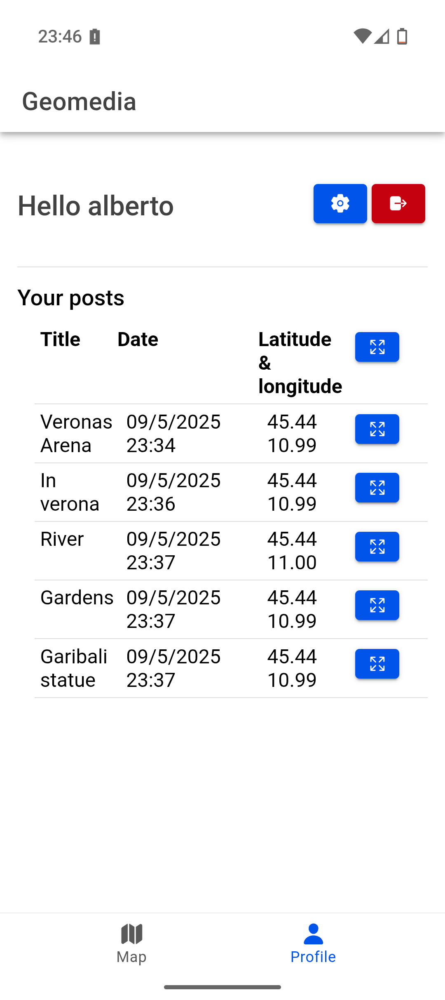

# Geo Media

This project is for WNMA Course at University of Padua (Master Degree in Computer Science).

Wireless Network for Mobile Application (WNMA) course held by Professor Claudio Enrico Palazzi, aims to study and understand network in mobile application, optimizing and improving traffic and sensors.

For a detailed report, check out the report: [WNMA_AlbertoMorini_Geomedia_Report](WNMA_AlbertoMorini_Geomedia_Report.pdf)

## Concept
GeoMedia insert itself among the others Online Social Networks (OSNS), offering another way to share content in order to discover new places by adding a comment or a multimedia file in the current user location.
In fact, the app provides just a geographical map, where users can fill it by posting not just photos or videos, but also recorded audio, music, files, or just textual comment. So, users are in charge of enriching the map of a city by creating a post, then for example, giving others the opportunity to discover secrets
spots or facts about a place.

GeoMedia makes users interact with the real world by retrieving the current location and then fetching the server to gets the contents around them.
The method to compute the distance among the current user location and the position of the limited content within the kilometers chosen, is an implementation of Vincenty’s formulae

### Architecture design

This project reflect the "three tier architecture" (https://www.ibm.com/think/topics/three-tier-architecture), providing a specific actor for each scope:
- **Presentation layer**: Android application, which allows users to sign in or create an account, then to see others users' post and sharing some
- **Application layer**: A simple HTTP server which lsiten the requests and store/retreive the data
- **Data layer**: A DBMS thus to store, clean, check and manipulate data.

## Dependendices and tecnologies

### Client application:

made with React using the "Ionic Framework" as graphic wrapper and then compiled for Android platforf.
Usign Capacitor thus to get users' location and to store file (download posts' media) into the mobile phones

- https://capacitorjs.com/docs/apis/filesystem
- https://capacitorjs.com/docs/apis/geolocation
- https://ionicframework.com/
- https://react.dev/

The map is provided via "Pigeon Maps" React-Component
- https://pigeon-maps.js.org/

### Server layer

The server is created with NodeJS, just using the native Node module "http" which allows to easily create an http server, providing endpoints to handle the requests

Otherwise, the package 'tedious' (`npm i tedious`) is required to connecto to MSSQL Database

### Data layer

The DBMS chosen is Microsoft SQL Server (MSSQL), which is a solid and very used solution to store and manage data.

## Pictures

| **Location permission** | **login** |
| ------------ | ------------- |
|  | |

| **mapoverview** | **post view** |
| ------------ | ------------- |
|  |  |

| **User account** | **postcreation** |
| ------------ | ------------- |
|  |  |

