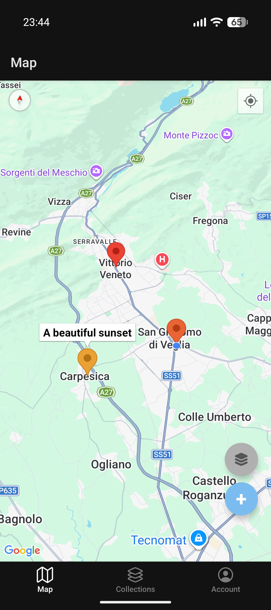
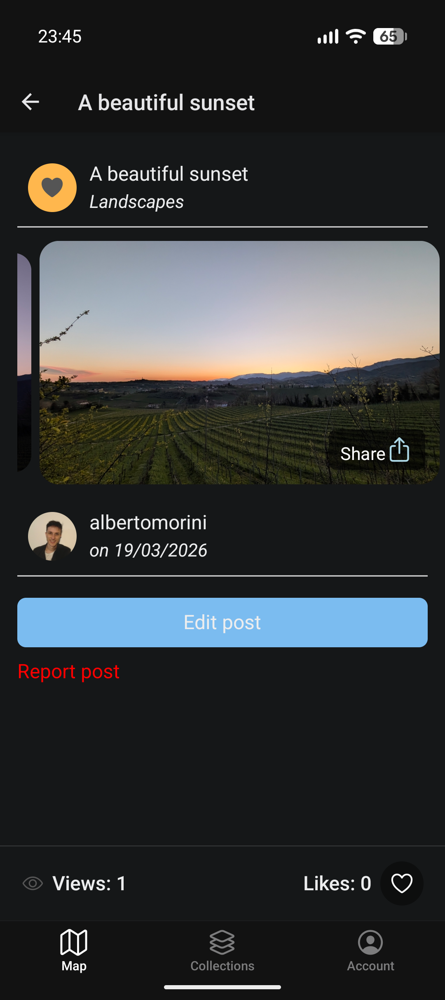
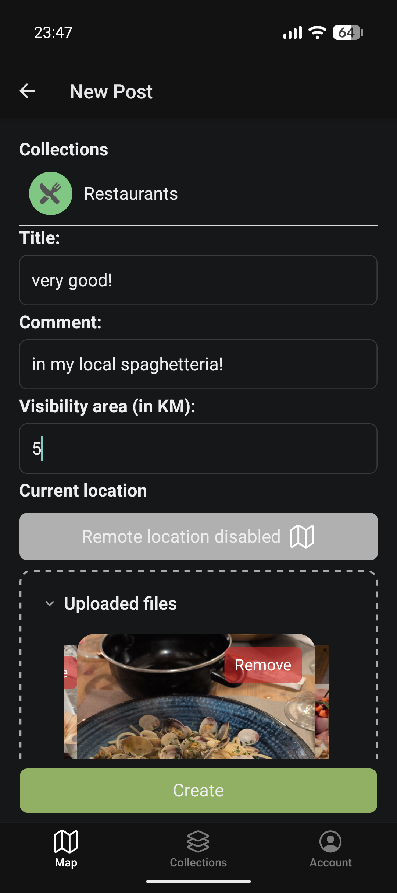
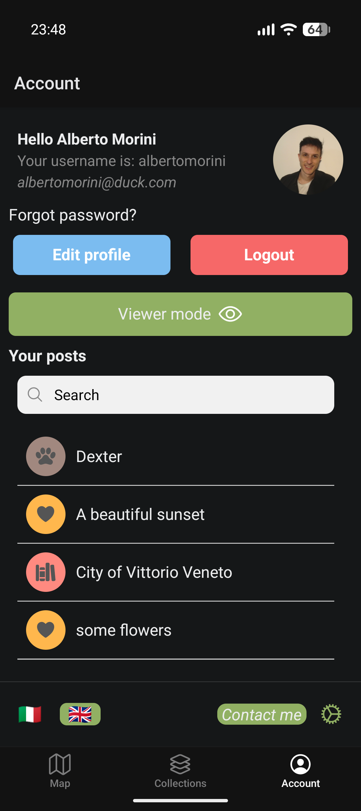
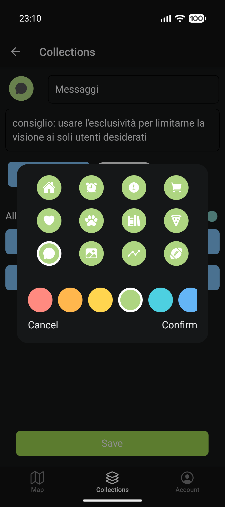
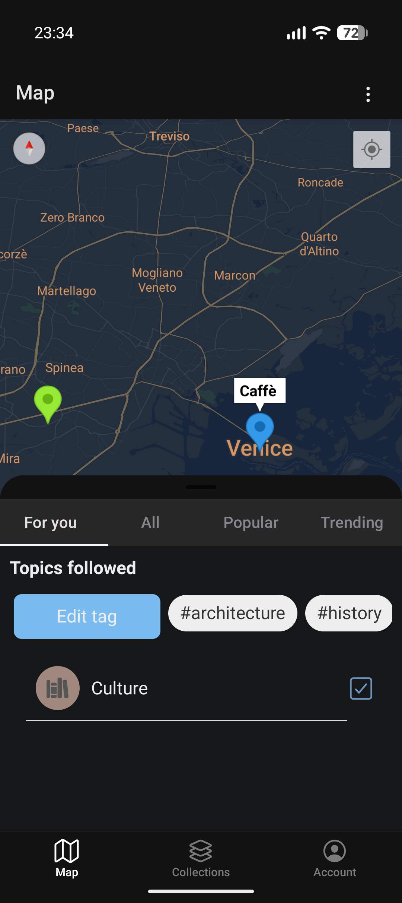
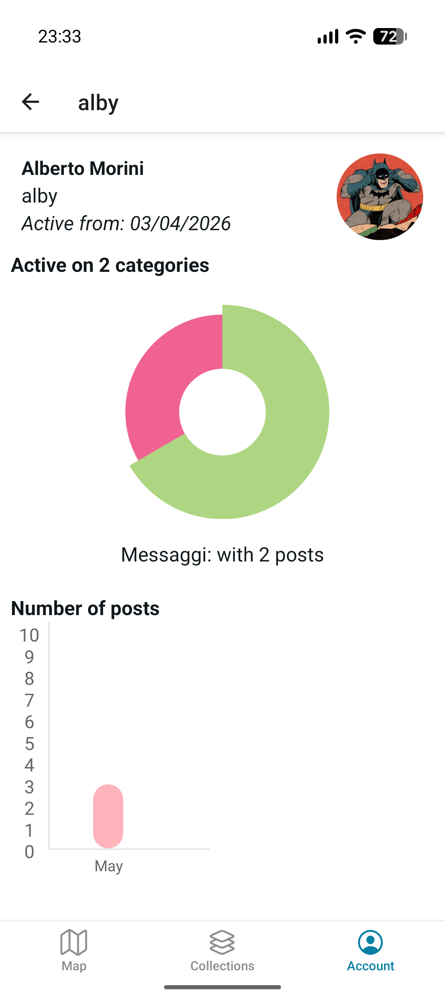
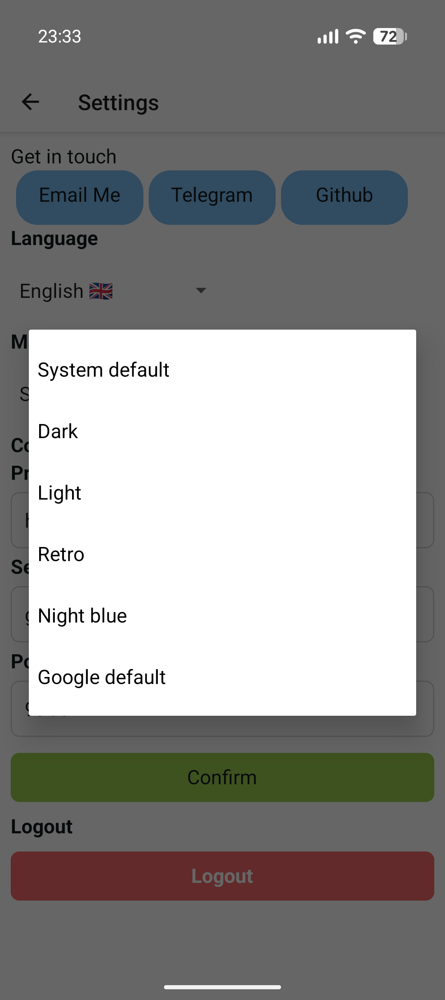

# GeoMedia

> Master Thesis for <a href="https://www.unipd.it/offerta-didattica/corso-di-laurea-magistrale/scienze?ordinamento=2025&key=SC2598&tipo=LM&scuola=SC">Computer Science</a> at University of Padua. (LM-18)

- Author: Alberto Morini
- Supervisor: Professor Claudio Enrico Palazzi
- Co-Supervisor: Lorenzo Perinello

> The first version of this project was implemented with <a href="https://ionicframework.com/">IonicFramework<a/> and <a href="https://pigeon-maps.js.org/">Piegon Maps</a>, for Wireless Network for Mobile Application course.
- _See the Ionic branch for that version_ (same repository)

Also presented at <a href="https://goodit2025.idlab.uantwerpen.be/">GoodIT 2025 </a> (Antwerp, Belgium)
- Full research available on <a href="https://www.research.unipd.it/handle/11577/3575540">UNIPD site</a>

## Concept
GeoMedia insert itself among the others Online Social Networks (OSNS), offering another way to share content in order to discover new places by adding a comment or a multimedia file in the current user location.
In fact, the app provides just a geographical map, where users can fill it by posting not just photos or videos, but also recorded audio, music, files, or just textual comment. So, users are in charge of enriching the map of a city by creating a post, then for example, giving others the opportunity to discover secrets
spots or facts about a place.


GeoMedia makes users interact with the real world by retrieving the current location and then fetching the server to gets the contents around them.
The method to compute the distance among the current user location and the position of the limited content within the kilometers chosen, is an implementation of Vincenty’s formulae

### Architecture design

This project reflect the ["three tier architecture"](https://www.ibm.com/think/topics/three-tier-architecture), providing a specific actor for each scope:
- Presentation layer: Android application, which allows users to sign in or create an account, then to see others users' post and sharing some
- Application layer: A simple HTTP server which lsiten the requests and store/retreive the data
- Data layer: A DBMS thus to store, clean, check and manipulate data.


## Dependendices and tecnologies

### Client application:
> ReactNative with Expo framework

**Functionalities**:
- GPS location (precise or approximate) for GoogleMaps
  - 5 different themes for Google Maps and automatic Dark Mode
- Camera built-in
- Share or download content uploaded
- File System handling: thus to upload any kind of file
- Server configurable: use the same client to connect through different servers


implementing several packages like:
- expo
- react-native-maps
- @react-native-community/geolocation
- @shopify/flash-list
- expo-secure-store
- react-native-gesture-handler
- react-native-vision-camera
- *check  package.json for all dependencies*

<p align="center">
  
  
  
  
  
  
  
  
</p>

### Server layer

HTTP REST Server created with Python and [FastAPI](https://fastapi.tiangolo.com/), thus to realize a robust, hgihly performant endpoints and automatically documented through [Swagger](https://swagger.io/) 


Hosted on production on: [Hetzner](https://www.hetzner.com/) 

### Data layer

The DBMS chosen is [Microsoft SQL Server (MSSQL)](https://www.microsoft.com/en-us/sql-server/sql-server-downloads), which is a solid and higly used solution to store and manage data.


Adopted via [docker image](https://hub.docker.com/r/microsoft/mssql-server/) 

```sh
docker run \
-e "ACCEPT_EULA=Y" \
-e "MSSQL_SA_PASSWORD="  \
-e "MSSQL_PID=Evaluation"  \
-p 1433:1433   \
--name sql2025  \
--hostname sql2025  \
-d mcr.microsoft.com/mssql/server:2025-latest
```

